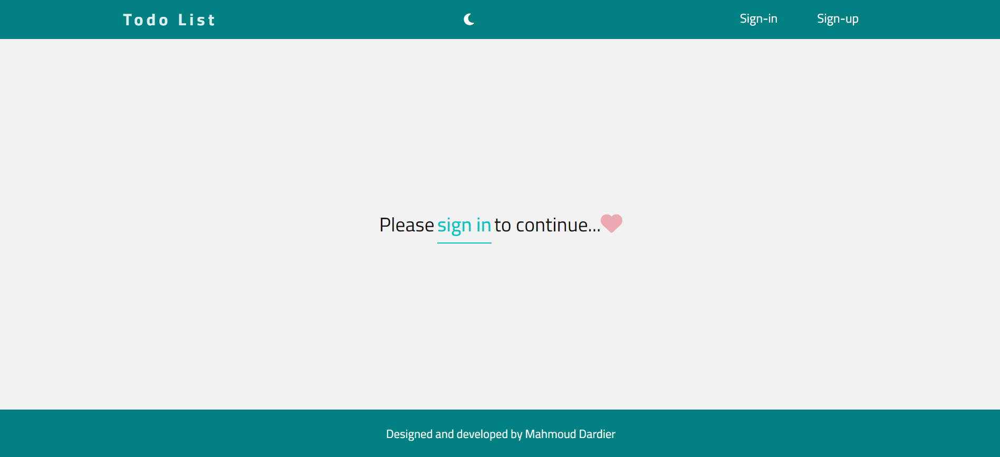
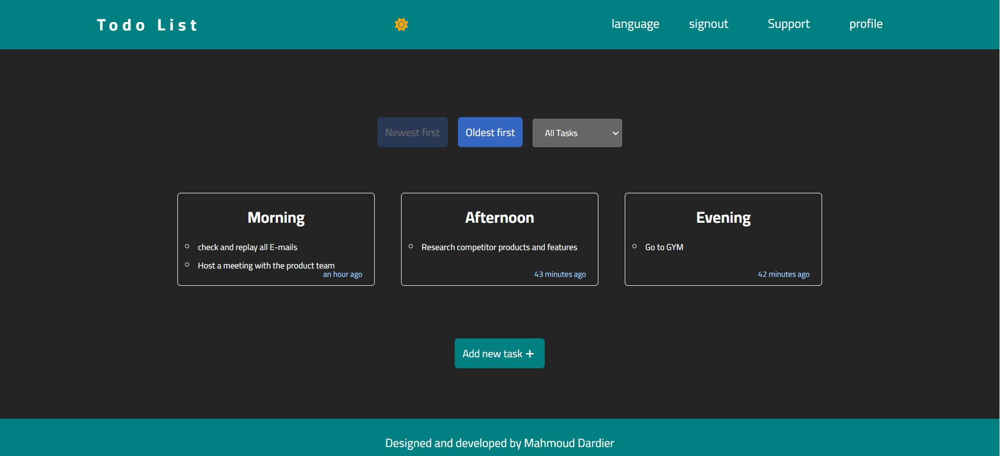
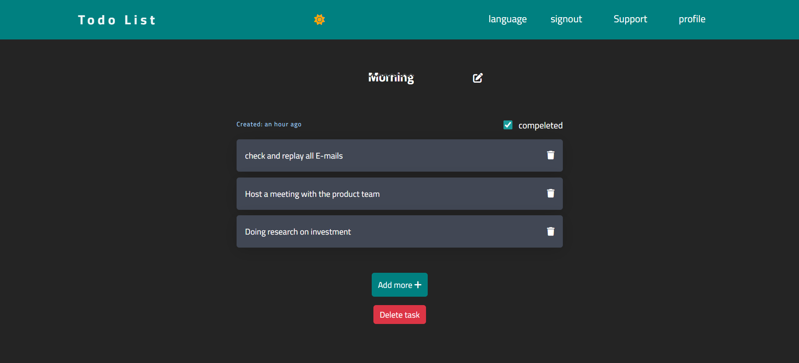

# Todo-list Application 🙌

The Todo-list Application is a robust task management tool built with React.js and integrated with Firebase for authentication and database services. This application ensures a secure and personalized experience, requiring users to sign in or sign up to access their tasks. It's designed to help users efficiently manage their daily responsibilities with a range of interactive features

## 🌟 [Live Website](https://todo-list-jet-five-39.vercel.app/) 🌟

## Table of Contents

- [Features](#features)
- [Screenshots](#screenshots)
- [Installation](#Installation)
- [Technologies Used](#technologies-used)
- [Contact](#contact)
  
## Features

* Create new tasks
* Mark tasks as completed
* Deleting tasks
* Updating your tasks
* Filter tasks by status (All, Completed, Non Completed)
* Change the order of tasks (Newest, oldest)
* Change themes: light dark
* Responsive Design

## Screenshot







## Installation

1. Clone the repository:
   ```bash
   git clone https://github.com/Mmostafa1999/Todo-list.git

2. Install dependencies:
   ```bash
   npm install

3. Run the development server:
   ```bash
   npm start

Feel free to contribute or report issues!

## Technologies Used

- Semantic HTML5 markup
- CSS custom properties
- Flexbox
- Responsive design
- [React](https://reactjs.org/) - JS library for building user interfaces.
1. **Custom Hooks:** Utilized custom React hooks for managing state and logic efficiently.
2. **React Helmet:** This reusable React component will manage all of your changes to the document head.
3. **React i18next:** provides a straightforward way to manage translations, supporting multiple languages and namespaces
4. **React Loading:** Easy to use loading animations for React projects.
- [Firebase](https://firebase.google.com/))
1. **Real-time Database:** Syncs data in real-time across all clients.
2. **Authentication:** Simplifies user authentication with ready-made UI libraries and backend services.
3. **Hosting:** Provides fast and secure hosting for web apps.
- [icons](https://fontawesome.com/icons) - Icons Library
- **Vercel** (for deployment)

## Contact
- [Author](https://github.com/Mmostafa1999)
- [Website](https://todo-list-jet-five-39.vercel.app/)
- [Email](mahmoud.mostafa4467@gmail.com)
- [Linkedin](https://www.linkedin.com/in/mahmoud-mustafa-642434188/)

